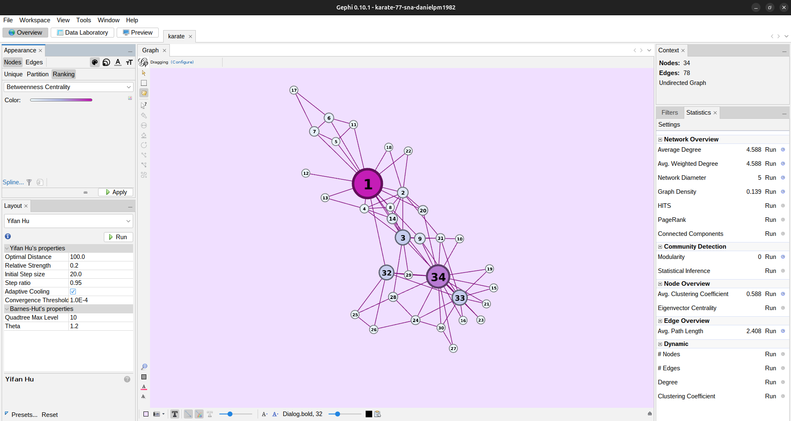
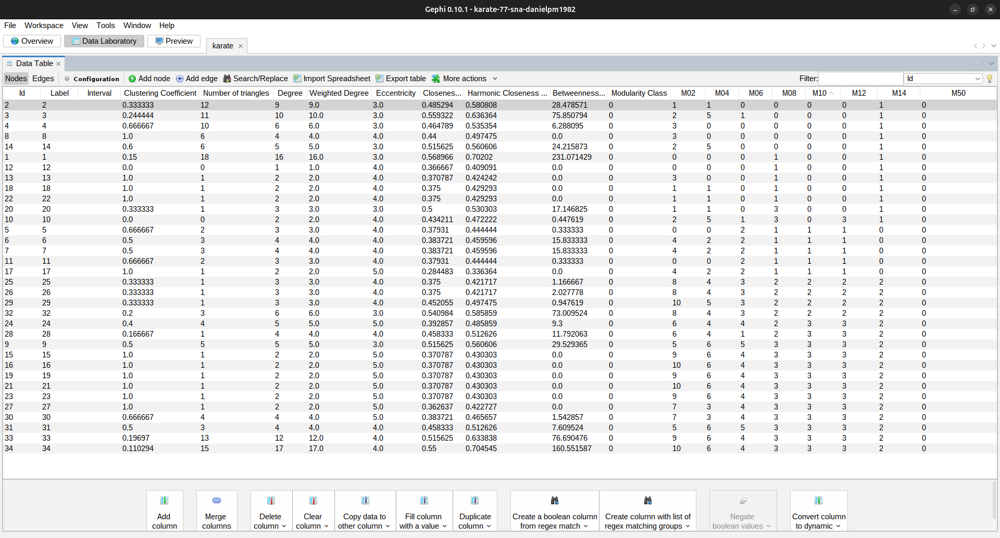
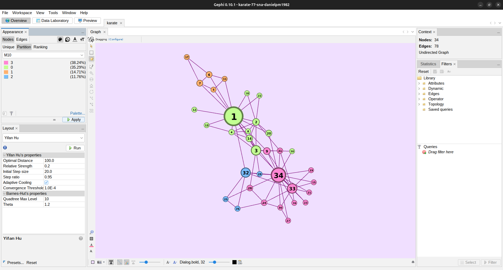
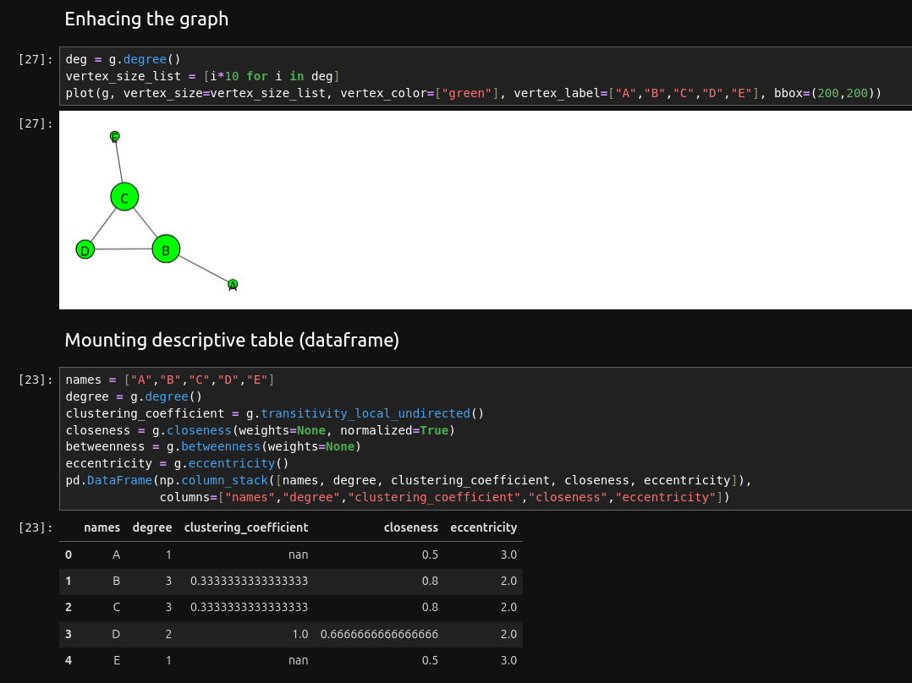
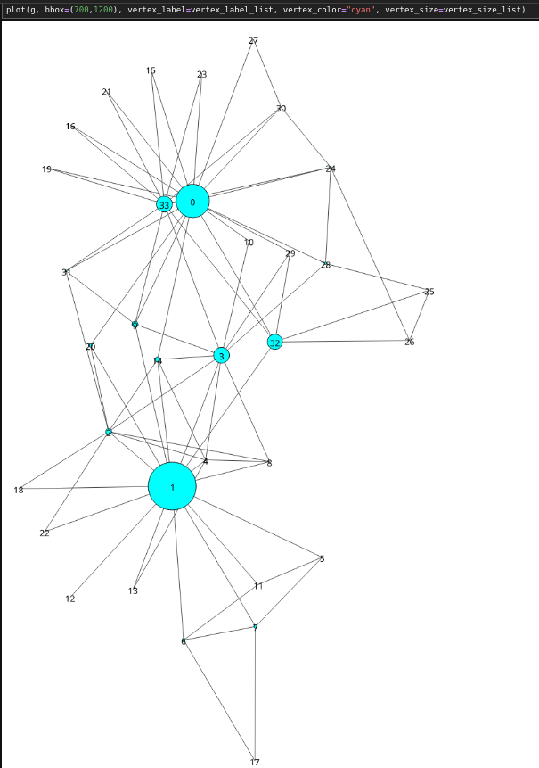
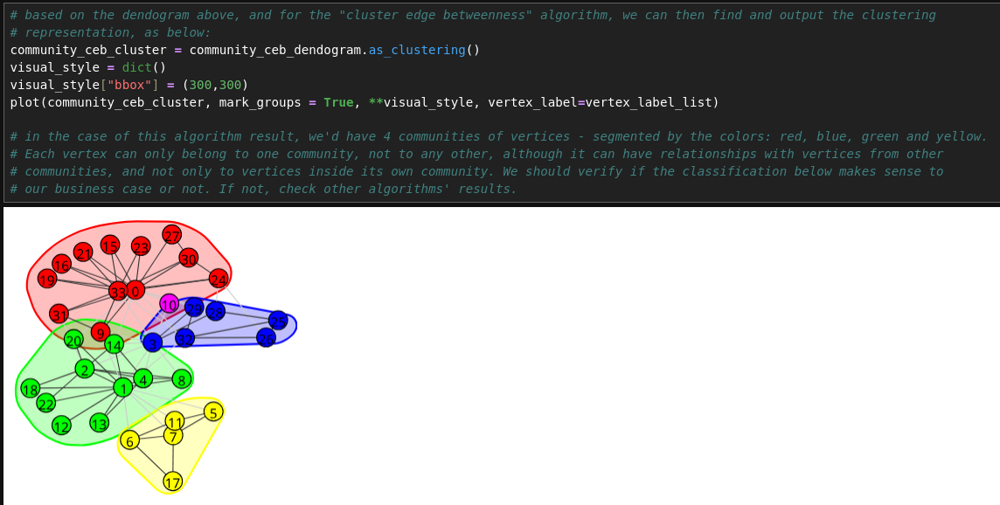
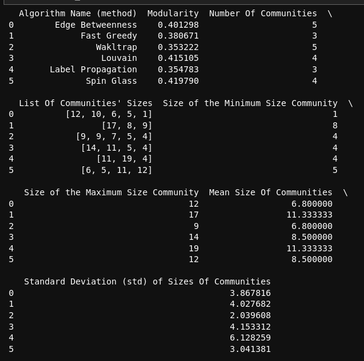
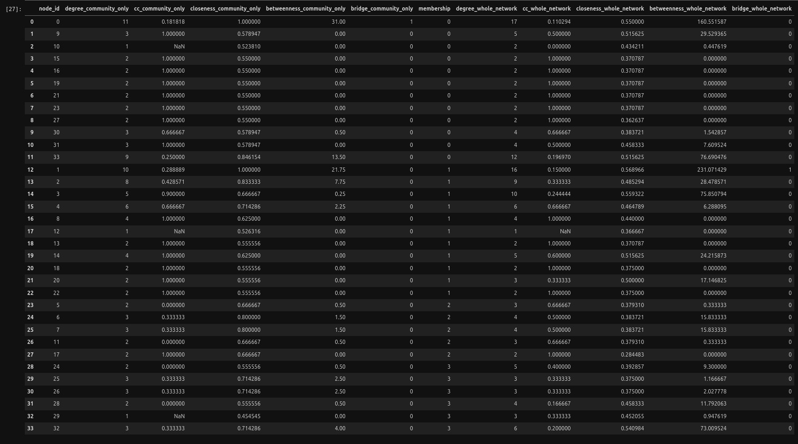

# sample-social-network-analysis
This is a Jupyter Notebook series collection about Social Network Analysis (SNA) using Python, Pandas, NumPy, IGraph, and other SNA specific libs, along with Anaconda managed environments

© 2025 Daniel Pinheiro Maia All Rights Reserved 
(see Copyright© License at the end of this text).

[**Description of this repository**] 
This is a Jupyter Notebook series collection about Social Network Analysis (SNA) using Python, Pandas, NumPy, IGraph, and other SNA specific libs, along with Anaconda managed environments.

[**Content**] 
GitHub jupyter notebook | Colab dynamic code import and run:

1 - Basic SNA manipulation with IGraph - creating and getting statistics from a simple 5-order Graph  
GitHub: 
https://github.com/danielpm1982/sample-social-network-analysis/blob/master/base-sna-statistics.ipynb  
Colab: 
https://colab.research.google.com/github/danielpm1982/sample-social-network-analysis/blob/master/base-sna-statistics(colab-version).ipynb  

2 - Advanced SNA manipulation with IGraph using a real-world Dataset - creating a Graph based on .csv files; getting general (whole) network statistics; classifying the network into Communities and getting intra-community stats, while comparing these with extra-community (whole-network) ones  
GitHub: 
https://github.com/danielpm1982/sample-social-network-analysis/blob/master/karate-sna-statistics.ipynb  
Colab: 
https://colab.research.google.com/github/danielpm1982/sample-social-network-analysis/blob/master/karate-sna-statistics(colab-version).ipynb  

3 - Gephi zipped file, with the same project data from item 2 above and some analysis already done, including Communities classification with different resolutions and modularities, for being opened at Gephi opensource app and have checked out what can be done with this GUI SNA app, rather than with Python or its IGraph lib. Available at this GitHub project root: https://github.com/danielpm1982/sample-social-network-analysis 

[**Source Code and Run**] 
Source code available at github.com, through the following link: 
[https://github.com/danielpm1982/sample-social-network-analysis](https://github.com/danielpm1982/sample-social-network-analysis)  
The source code includes the Jupyter Notebook .ipynb files themselves, one for each subproject, as well as the environment.yml file, which can be used to generate an Anaconda environment for running this project (and subprojects) locally (don't forget to customize the env paths to your own filesystem and OS when creating the environment). 
You can also run this Jupiter Notebook project remotely at [https://colab.research.google.com/notebook](https://colab.research.google.com/notebook), importing the content directly from this github repository to your Colab account, without having to create any Anaconda environment locally. 

[**Printscreen samples**] 

[**Support**] 
If you have any suggestion or correction about the content of this repository, please, feel free to open an issue at the project issues' section: 
https://github.com/danielpm1982/sample-genetic-algorithms/issues

[**Copyright© License**] 
© 2025 Daniel Pinheiro Maia All Rights Reserved 
This GitHub repository - and all code (software) available inside - is exclusively for academic and individual learning purposes, and is **NOT AVAILABLE FOR COMMERCIAL USE**, nor has warranty of any type. You're authorized to fork, clone, run, test, modify, branch and merge it, at your own risk and using your own GitHub account, for individual learning purposes only, but you're **NOT ALLOWED to distribute, sublicense and/or sell copies of the whole or of parts of it** without explicit and written consent from its owner / author. You can fork this repository to your individual account at GitHub, clone it to your personal notebook or PC, analyse, run and test its code, modify and extend it locally or remotely (exclusively at your own GitHub account and as a forked repository), as well as send issues or pull-requests to this parent (original) repository for eventual approval. GitHub is in charge of explicitly showing whom this respository has been forked from. **If you wish to use any of this repository content in any way other than what is expressed above, or publish it anyway or anywhere other than as a forked repository at your own GitHub account, please contact this repository owner / author** using GitHub or the contact info below. For the meaning of the technical terms used at this license, please refer to GitHub documentation, at https://help.github.com/en/github .

[**Owner and Author of this GitHub Repository**] 
Daniel Pinheiro Maia 
[danielpm1982.com](https://www.danielpm1982.com) 
danielpm1982@gmail.com 
[linkedin.com/in/danielpm1982](https://www.linkedin.com/in/danielpm1982) 
Brazil 
.
